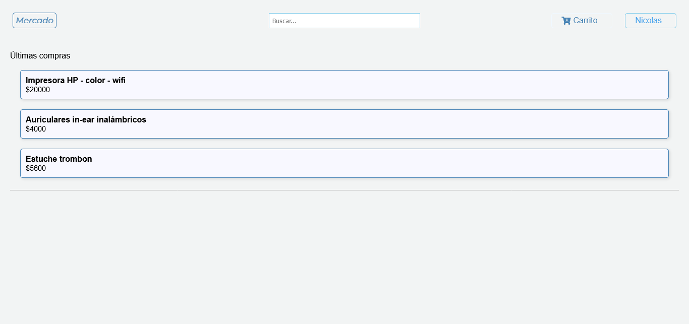

# Mercado 1 en MERN

Un sitio web para comprar productos, con carrito de compra y lógica de stock.
Todavía en desarrollo.
Tecnologías: React, Node, Express, Mongo DB.

*Version 1.0*

- Se pueden ver los productos sin tener cuenta
- Al crear cuenta se puede comprar productos, agregar al carrito de compras y ver historial de compras

## Inicio

## Acceder

## Crear Cuenta

## Inicio Usuario

## Menu

## Configuración de la Cuenta

## Visualización de Producto

Ejemplo de modal de producto a comprar

Se agrega producto al carrito

## Carrito de Compras

Producto agregado

Varios productos agregados

## Notificaciones

Notificacion de compra

Notificacion de compra en Menu

## Historial de Compras

Historial de Productos coprados

Modal del producto

## Busquedas

Ejemplo de Busqueda de producto (con sesión se puede agregar al carrito)

Modal de Busqueda de producto (con sesión se puede agregar al carrito)
